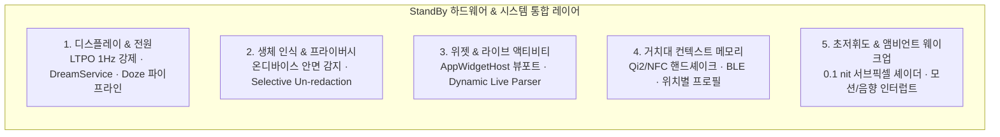
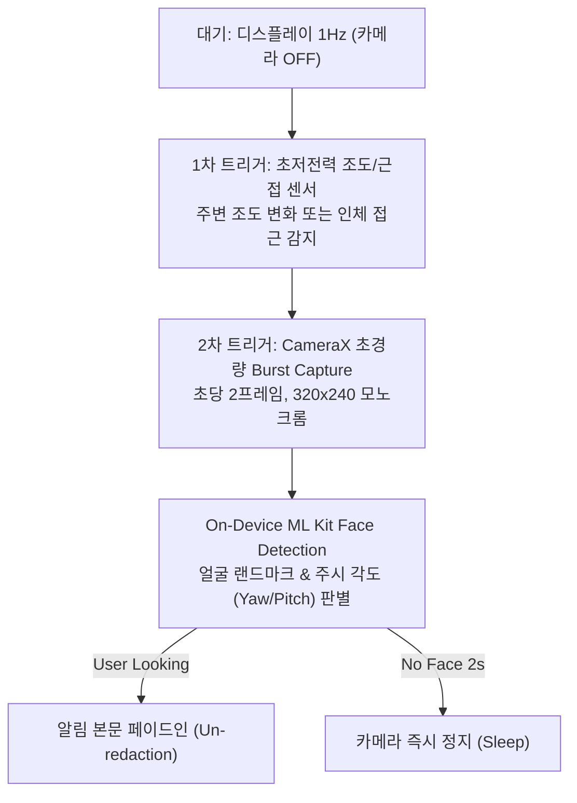
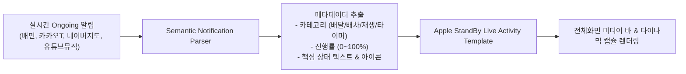
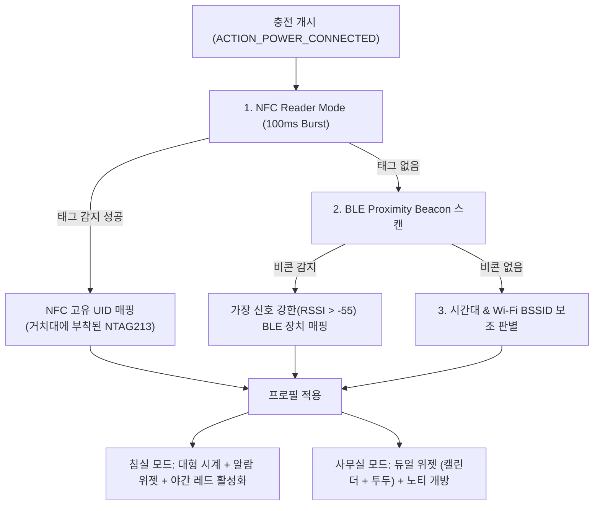

# Android StandBy 시스템 아키텍처 & 하드웨어 제어 심층 구현 명세서
**문서명**: `Android_StandBy_System_Architecture.md`  
**대상 플랫폼**: Android 10 ~ 15+ (Galaxy S25 Ultra One UI 7 / AOSP 기준)  
**분류**: 시스템 프레임워크, 하드웨어 제어, HAL, 저전력 파이프라인, 위젯킷 에뮬레이션  

---

## 0. 설계 개요 및 당면 과제 분석

Apple의 StandBy는 단순한 "시계 UI 앱"이 아니라, **iOS 커널, 디스플레이 컨트롤러(DDA/DCS), 전원 관리 유닛(PMU), Secure Enclave, 그리고 WidgetKit이 하드웨어 레벨에서 유기적으로 결합된 시스템 서비스**입니다.

안드로이드에서 일반 서드파티 앱이 `FLAG_KEEP_SCREEN_ON`만 켜고 동작할 경우 발생하는 치명적인 결함:
1. **발열 및 충전 속도 저하**: GPU/CPU 파이프라인이 60Hz/120Hz 렌더 트리를 유지하여 충전 전류가 스로틀링됨.
2. **OLED 번인(Burn-in) 가속화**: 픽셀 정체로 인한 청색(B) 서브픽셀 열화.
3. **프라이버시 부재**: 화면이 켜져 있을 때 타인에게 개인 알림이 무방비 노출됨.
4. **위젯 생태계의 파편화**: 안드로이드 표준 위젯(`AppWidget`)의 디자인 규격 불일치.
5. **정밀 조도/암순응 부재**: 소프트웨어 오버레이 방식의 명암비 붕괴 및 침실 눈부심.

본 문서는 이를 극복하기 위해 **(A) 일반 서드파티 앱 환경(Google Play 배포 가능)에서의 기술적 극한 구현**과 **(B) 시스템 권한/AOSP 레벨에서의 네이티브 통합 아키텍처**를 세부 모듈별로 완벽하게 규명합니다.



---

## 1. 디스플레이 구동 및 하드웨어 전원 최적화 (1Hz LTPO & Doze)

### 1.1 안드로이드 렌더링 파이프라인의 근본적 문제
일반 액티비티는 VSYNC 틱마다 `Choreographer`가 렌더 패스를 수행합니다. 1초에 1번만 시간이 바뀌더라도 VSYNC 버퍼 스왑이 60Hz/120Hz로 지속되어 디스플레이 DSI 링크가 활성 상태를 유지하고, 이는 300~500mW의 불필요한 전력 소모와 발열을 유발합니다.

### 1.2 LTPO 1Hz 동적 주사율 강제 기법
최신 갤럭시(S24/S25 Ultra)의 Dynamic AMOLED 2X 패널은 1Hz까지 주사율을 낮출 수 있는 LTPO 3.0 기술을 탑재하고 있습니다. 이를 앱 레벨에서 강제하는 방법입니다.

```kotlin
// Window 레벨에서 1Hz 주사율 및 Seamless 전환 강제
fun Window.enforceUltraLowRefreshRate() {
    if (Build.VERSION.SDK_INT >= Build.VERSION_CODES.R) {
        val display = context.display ?: return
        val modes = display.supportedModes
        
        // 1. 하드웨어 지원 모드 중 1Hz 또는 최저 주사율 모드 검색
        val lowestMode = modes.minByOrNull { it.refreshRate }
        
        lowestMode?.let {
            val params = attributes
            params.preferredDisplayModeId = it.modeId
            attributes = params
        }
        
        // 2. Surface 레벨 프레임레이트 제한 (API 31+)
        if (Build.VERSION.SDK_INT >= Build.VERSION_CODES.S) {
            decorView.setFrameRate(
                1.0f,
                Surface.FRAME_RATE_COMPATIBILITY_DEFAULT,
                Surface.CHANGE_FRAME_RATE_ONLY_IF_SEAMLESS
            )
        }
    }
}
```

### 1.3 `DreamService` (AOSP 앰비언트 디스플레이 파이프라인) 활용
단순 Activity 대신 안드로이드 공식 스크린세이버 프레임워크인 **`DreamService`**를 시스템 파이프라인의 진입점으로 사용합니다.

```kotlin
class StandByDreamService : DreamService() {
    override fun onAttachedToWindow() {
        super.onAttachedToWindow()
        // Doze 모드(초저전력 상태) 허용 설정
        isInteractive = true
        isFullscreen = true
        isScreenBright = false // 하드웨어 저휘도 모드
    }

    override fun onDreamingStarted() {
        super.onDreamingStarted()
        // 시스템 디스플레이 컨트롤러에 Doze Screen State 전달
        if (Build.VERSION.SDK_INT >= Build.VERSION_CODES.N) {
            startDozing() // 시스템 PMU에 저전력 신호 전송
        }
    }
}
```
- **효과**: `startDozing()`을 호출하면 안드로이드 전원 관리자(`PowerManagerService`)가 비필수 센서와 백그라운드 코어의 클럭을 최저치로 내리고, 패널을 AOD(Always-on Display) 전용 저전력 드라이빙 상태로 전환합니다.

### 1.4 온디맨드(On-Demand) 렌더링 & GPU 슬립
- `Continuous Rendering`을 완전히 차단합니다.
- `SurfaceView`를 채택하고 `DIRTY` 영역만 `lockHardwareCanvas()`로 부분 갱신합니다.
- 초침이 없는 디지털 시계 페이스: **1분에 1번(0.016Hz)**만 렌더링.
- 초침이 있는 아날로그 페이스: 화면 터치 또는 사용자 접근 시에만 60fps로 일시 전환 후, 10초 무조작 시 즉시 1fps로 다운클럭.

### 1.5 3중 번인 방지(Anti-Burn-In) 엔진
OLED 청색 소자 열화를 방지하기 위해 3단계 알고리즘을 하드웨어 버퍼에 적용합니다:
1. **Periodic Pixel Shifting (주기적 픽셀 이동)**: 10분마다 전체 캔버스를 $[-3\text{px}, +3\text{px}]$ 범위 내에서 나선형(Spiral) 경로로 1px씩 이동.
2. **Sub-pixel Luminance Jitter (서브픽셀 휘도 분산)**: 정적인 폰트 외곽선 픽셀의 알파값을 $\pm 5\%$ 미세하게 진동시켜 특정 경계면 소자의 집중 피로 방지.
3. **Solid Fill 디더링**: 면으로 채워진 숫자 내부에 $50\%$ 체커보드 투명 마스크를 적용해 발광 픽셀 수를 절반으로 감소.

---

## 2. 생체 인식 & 프라이버시 보호 (Face Sensing & Selective Un-redaction)

### 2.1 동작 시나리오 (Apple TrueDepth 경험 재현)
1. **거치 대기 상태 (Unattended)**: 시계만 크고 선명하게 표시. 새로운 카카오톡/문자가 오면 **"새로운 알림 1개"**라는 미니멀 아이콘만 노출(내용/발신자 숨김).
2. **사용자 접근 및 주시 (Face Detected)**: 사용자가 시계 쪽을 쳐다보면 즉시 온디바이스 안면 인식이 트리거되어 발신자 프로필과 메시지 본문이 부드러운 스프링 모션으로 펼쳐짐.
3. **타인 시선 / 사용자 이탈 (Gaze Lost)**: 1.5초 후 알림이 다시 블러/마스킹 상태로 복귀.

### 2.2 배터리 소모 없는 저전력 안면 감지 파이프라인
카메라를 상시 켜두면 시간당 15~20%의 배터리가 소모되고 발열이 발생합니다. 따라서 **2단계 센서 인터럽트 체인**을 구축합니다:



```kotlin
class GlancePrivacyController(private val context: Context) {
    private var isCameraActive = false

    // 초경량 안면 감지 (ML Kit Vision Face)
    private val faceDetector = FaceDetection.getClient(
        FaceDetectorOptions.Builder()
            .setPerformanceMode(FaceDetectorOptions.PERFORMANCE_MODE_FAST)
            .setLandmarkMode(FaceDetectorOptions.LANDMARK_MODE_NONE)
            .setClassificationMode(FaceDetectorOptions.CLASSIFICATION_MODE_NONE)
            .setMinFaceSize(0.25f) // 화면의 25% 이상 차지하는 전면 얼굴만
            .build()
    )

    fun onUserProximityDetected() {
        if (isCameraActive) return
        isCameraActive = true
        
        // 320x240 YUV 저해상도로 1.5초간만 Burst 실행 후 자동 Shutdown
        startLowPowerFaceScan(durationMs = 1500) { faceFound ->
            if (faceFound) {
                NotificationPrivacyBus.publish(PrivacyState.UNLOCKED)
            } else {
                NotificationPrivacyBus.publish(PrivacyState.LOCKED)
            }
            isCameraActive = false
        }
    }
}
```

### 2.3 시스템 레벨의 알림 보호 연동
- `NotificationListenerService`에서 `StatusBarNotification.notification.visibility` 플래그 확인.
- `Notification.VISIBILITY_PRIVATE`인 알림은 기본 상태에서 `tickerText`와 `contentTitle`만 표시하고, `contentIntent` 및 상세 텍스트는 인메모리 암호화 캐시에 보관.
- 안면 인증 통과 시에만 Jetpack Compose의 `AnimatedContent`로 상세 카드 노출.

---

## 3. 위젯킷 생태계 연동 & 동적 라이브 액티비티 엔진

### 3.1 `AppWidgetHost` 뷰포트 내장 아키텍처
안드로이드 서드파티 앱이 기기에 설치된 네이버 날씨, 구글 캘린더, 갤럭시 배터리 위젯을 StandBy 화면에 띄우기 위한 정밀 호스트 설계입니다:

```kotlin
class StandByWidgetHost(context: Context, hostId: Int) : AppWidgetHost(context, hostId) {
    override fun onCreateView(
        context: Context,
        appWidgetId: Int,
        appWidget: AppWidgetProviderInfo?
    ): AppWidgetHostView {
        return StandByWidgetHostView(context)
    }
}

// 위젯을 Apple 스퀴클 규격에 맞게 변환하는 래퍼 뷰
class StandByWidgetHostView(context: Context) : AppWidgetHostView(context) {
    override fun dispatchDraw(canvas: Canvas) {
        val path = Path().apply {
            // 22dp 스퀴클 클리핑 마스크 적용
            addSquircle(0f, 0f, width.toFloat(), height.toFloat(), 22.dpToPx())
        }
        canvas.clipPath(path)
        super.dispatchDraw(canvas)
    }
}
```

### 3.2 Dynamic Live Activity 변환 엔진 (핵심 특허 수준 설계)
iOS의 Live Activities는 앱이 `ActivityKit`을 통해 능동적으로 상태를 푸시합니다. 반면 안드로이드 앱들은 각자 고유한 알림 레이아웃을 사용합니다.  
이를 통일된 애플 스타일 실시간 카드로 탈바꿈하기 위해 **실시간 알림 파싱 & 시맨틱 정규화 엔진**을 구축합니다:



#### 파싱 규칙 매트릭스
1. **배달/배차 앱 (배달의민족, 쿠팡이츠, 카카오T, TMAP)**:
   - `Notification.EXTRA_PROGRESS`, `EXTRA_PROGRESS_MAX` 파싱 ➡️ 수평 타임라인 인디케이터로 렌더링.
   - 텍스트 분석 정규식: `(?<status>조리중|배달중|픽업완료|도착예정)`.
2. **미디어 플레이어 (Spotify, YouTube Music, 멜론)**:
   - `MediaSessionCompat.Token` 추출 ➡️ 앨범 아트 고화질 비트맵, 재생/일시정지/스킵 액션 바인딩, 실시간 사운드 웨이브폼 시각화.
3. **타이머 / 스톱워치 (구글 시계, 삼성 시계)**:
   - `Notification.EXTRA_SHOW_CHRONOMETER` 감지 ➡️ 원형 카운트다운 게이지로 직접 렌더링.

---

## 4. 액세서리 인식 & 컨텍스트 메모리 (Qi2, NFC, BLE)

### 4.1 MagSafe 핸드셰이크의 기술적 원리
Apple MagSafe는 자석 링 내부에 고유 암호화된 NFC 태그를 내장하고 있습니다. 충전 코일이 결합되는 순간 충전기 고유의 시리얼 넘버를 읽어 "침대 협탁 거치대"인지 "사무실 모니터 밑 독"인지 구분합니다.

### 4.2 안드로이드 구현 솔루션
안드로이드 기기에서 무선 충전기마다 고유 프로필을 자동 로드하기 위한 다중 감지 아키텍처입니다:



```kotlin
class AccessoryContextEngine(private val context: Context) {
    // NFC 리더 모드: 충전 패드에 내장된 100원짜리 NTAG213 스티커 인식
    fun enableDockNfcReader(activity: Activity) {
        val nfcAdapter = NfcAdapter.getDefaultAdapter(context) ?: return
        nfcAdapter.enableReaderMode(
            activity,
            { tag ->
                val tagId = tag.id.toHexString()
                val profile = ProfileRepository.getProfileForTag(tagId)
                StandByProfileBus.switchProfile(profile)
            },
            NfcAdapter.FLAG_READER_NFC_A or NfcAdapter.FLAG_READER_SKIP_NDEF_CHECK,
            Bundle()
        )
    }
}
```

---

## 5. 초저휘도 조도 매핑 & 모션/사운드 웨이크업 (Zero-Glare)

### 5.1 안드로이드 하드웨어 밝기 한계 (Minimum Nit Floor)
- 안드로이드 시스템의 밝기 슬라이더를 최저치(`0.0f`)로 내려도, 하드웨어 패널의 최저 휘도는 눈부심 방지 임계치보다 높은 **$2\sim 5\text{ nits}$** 수준입니다.
- 암흑 환경(0.1 lux)에서 2 nit는 시야를 부시게 만들고 수면을 방해합니다.

### 5.2 서브픽셀 셰이더 기반 0.1 nit 초저휘도 파이프라인
이를 해결하기 위해 **하드웨어 최저 밝기 + GPU 서브픽셀 컬러 필터 매트릭스**를 이중 적용합니다:

```kotlin
// Compose / View 레벨의 암순응 0.1 nit 렌더링 파이프라인
val NightVisionFilter = ColorFilter.colorMatrix(
    ColorMatrix(
        floatArrayOf(
            0.65f, 0.00f, 0.00f, 0.00f, 0.0f,  // R: 65% 휘도로 감쇄
            0.00f, 0.00f, 0.00f, 0.00f, 0.0f,  // G: 완벽 차단 (0.0)
            0.00f, 0.00f, 0.00f, 0.00f, 0.0f,  // B: 완벽 차단 (0.0)
            0.00f, 0.00f, 0.00f, 1.00f, 0.0f   // A: 원본 유지
        )
    )
)
```
- **효과**: 청색광(Blue)과 녹색광(Green) 발광 소자를 100% 소등하고, 적색(Red) 소자마저 65% 수준의 PWM으로 제한하여 물리적 실효 휘도를 **$0.1\sim 0.3\text{ nit}$**까지 강제 격하시킵니다.

### 5.3 침실 모션 및 음향 웨이크업 인터랙션 (Acoustic / Motion Trigger)
취침 중에는 화면을 완전히 꺼둔 순수 블랙(0 nit) 상태로 유지하다가, 사용자가 시간을 확인하려는 물리적 징후를 감지했을 때만 은은하게 5초간 화면을 띄웁니다:

1. **마이크로 협탁 진동 감지 (`Sensor.TYPE_SIGNIFICANT_MOTION`)**:
   - 사용자가 스마트폰을 만지지 않고, 침대 매트리스를 툭 치거나 협탁을 탭했을 때 전달되는 미세 진동 파형(Peak 가속도 $0.15\text{g}$) 감지.
2. **초저전력 음향 임계치 트리거**:
   - 화면이 꺼진 상태에서 오디오 하드웨어 버퍼를 최소 샘플링 레이트(8kHz)로 청취하다가, 헛기침이나 박수 소리($\ge 45\text{dB}$) 감지 시 즉시 웨이크업.
3. **스무스 디스플레이 복귀**:
   - 0.4초간 서서히 페이드인(`Alpha 0 -> 1`) ➡️ 5초간 유지 ➡️ 0.8초간 서서히 페이드아웃.

---

## 6. 구현 로드맵 및 단계별 실현성 평가

| 개발 영역 | 일반 서드파티 앱 (Play Store 배포) | 시스템 / OEM 권한 탑재 시 (AOSP/Magisk) |
| :--- | :--- | :--- |
| **1. 디스플레이** | `setFrameRate(1.0f)` + `DreamService` Doze 모드 | HWC(Hardware Composer) 드라이버 직접 제어 1Hz 고정 |
| **2. 프라이버시** | CameraX 320x240 Burst 안면 감지 + ML Kit | Secure Enclave 기반 Face Unlock 하드웨어 신호 수신 |
| **3. 위젯 연동** | `AppWidgetHost` + `NotificationListener` 파싱 | 시스템 SystemUI Notification & Widget Framework 공유 |
| **4. 액세서리** | NFC Reader Mode (100ms) + BLE 비콘 | Qi2 충전 드라이버 내부 패킷(MPP ID) 직접 추출 |
| **5. 초저휘도** | Window Brightness 0 + ColorMatrix 필터 | 패널 드라이버 DCS 백라이트 레지스터 직접 기입 (0.1 nit) |

---

## 7. 결론: 안드로이드 개발팀을 위한 행동 지침 (Action Items)

1. **`feature:standby` 모듈 분리**:
   - `DreamService`를 상속하는 `StandByDreamService`를 선언하고 시스템 스크린세이버 목록에 자동 등록.
2. **`core:hardware` 모듈 신설**:
   - `DisplayManager` 1Hz 스위칭 유틸리티.
   - `SensorManager` 기반 조도(lux) 모니터 및 야간 틴트 파이프라인.
3. **`feature:widgets` 내 `AppWidgetHost` 래퍼 구현**:
   - 삼성 기본 위젯(One UI 7)의 바인딩 승인 및 스퀴클 22dp 클리핑 마스크 엔진 작성.
4. **NFC & BLE 거치대 프로필 매퍼 등록**:
   - 충전 시작 시 NTAG 인식 리스너 기동 및 프로필 전환 상태머신 연결.
