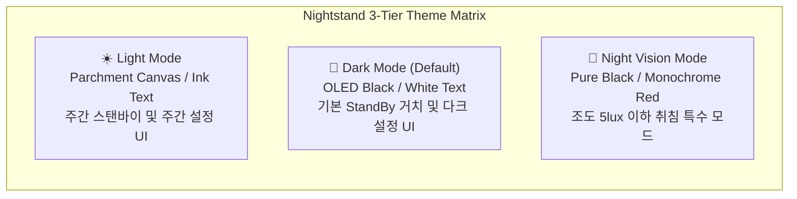

# Design System Specification: Apple StandBy Clock

> **Project**: Nightstand (`com.lsk0522.nightstand`)  
> **Reference Standard**: [getdesign.md/apple](https://getdesign.md/apple/design-md) + Apple Human Interface Guidelines (HIG)  
> **Target Platforms**: Android (Galaxy S25 Ultra One UI 7 / Android 15), Jetpack Compose  

---

## 1. 듀얼 테마 체계: 라이트 모드 vs 다크 모드 vs 야간 모드

본 디자인 시스템은 **라이트(Light), 다크(Dark), 야간 암순응(Night Vision Red)**의 3단계 완전 테마 체계를 지원합니다.



### 1.1 테마별 사용 맥락 (Context)
1. **라이트 모드 (Light Mode)**:
   - 밝은 낮 시간대의 거치 환경, 혹은 사용자가 시스템 라이트 모드를 선호할 때 적용.
   - 배경: 애플 고유의 따뜻하고 정갈한 오프화이트인 **Parchment (`#F5F5F7`)**와 퓨어 화이트 카드.
   - 텍스트: 완전한 검정이 아닌 **Near-Black Ink (`#1D1D1F`)**를 사용하여 눈의 피로를 덜고 종이 인쇄물 같은 우아한 대비 형성.
2. **다크 모드 (Dark Mode - StandBy 기본값)**:
   - StandBy 거치 시의 표준 모드.
   - 배경: AMOLED 픽셀을 꺼 배터리 소모를 제로화하는 **트루 블랙 (`#000000`)**.
   - 카드/텍스트: 딥 차콜 카드(`surface-tile-1` `#1C1C1E`)와 선명한 퓨어 화이트(`#FFFFFF`) 숫자.
3. **야간 암순응 모드 (Night Vision Red Mode)**:
   - 침실 소등 후 멜라토닌 분비 억제를 막기 위해 전체 UI를 **적색 모노크롬 (`#FF453A`)** 단색과 블랙으로 전환.

---

## 2. 시맨틱 컬러 매트릭스 (Color Comparison Table)

코드를 작성할 때 테마에 따라 컴포넌트 색상이 어떻게 대응하는지 정의한 단일 매트릭스입니다:

| 의미론적 토큰 (Semantic Token) | ☀️ 라이트 모드 (Light) | 🌙 다크 모드 (Dark) | 🚨 야간 적색 (Night Vision) | 용도 |
| :--- | :--- | :--- | :--- | :--- |
| **`canvas`** | `#F5F5F7` (Parchment) | `#000000` (True Black) | `#000000` (True Black) | 전체 화면 최하단 배경 |
| **`surface-card`** | `#FFFFFF` (Pure White) | `#1C1C1E` (Tile Dark 1) | `rgba(255, 69, 58, 0.06)` | 시계/위젯 카드 서피스 |
| **`surface-card-secondary`** | `#FAFAFC` (Pearl) | `#2C2C2E` (Tile Dark 2) | `rgba(255, 69, 58, 0.12)` | 버튼, 입력창, 선택 칩 |
| **`text-primary`** | `#1D1D1F` (Ink) | `#FFFFFF` (100% White) | `#FF453A` (Glow Red) | 메인 시·분 숫자, 핵심 타이틀 |
| **`text-secondary`** | `rgba(29, 29, 31, 0.60)` | `rgba(255, 255, 255, 0.60)` | `#801B17` (Muted Red) | 날짜, 요일, 보조 레이블 |
| **`text-tertiary`** | `rgba(29, 29, 31, 0.35)` | `rgba(255, 255, 255, 0.30)` | `#4D110E` (Deep Dim Red) | 아날로그 눈금, 초 단위 |
| **`primary-action`** | `#0066cc` (Action Blue) | `#2997ff` (Sky Link Blue) | `#FF453A` (Red Accent) | 메인 인터랙션 버튼 |
| **`border-hairline`** | `rgba(0, 0, 0, 0.08)` | `rgba(255, 255, 255, 0.08)` | `rgba(255, 69, 58, 0.20)` | 카드 외곽선 (1px) |
| **`border-glass-rim`** | `rgba(255, 255, 255, 0.80)` | `rgba(255, 255, 255, 0.12)` | `rgba(255, 69, 58, 0.30)` | 글래스 상단 하이라이트 |

---

## 3. 타이포그래피 시스템 (Typography Architecture)

Apple 인터페이스의 핵심은 **SF Pro의 엄격한 자간 공식과 고정폭 숫자 제어**입니다.

### 3.1 폰트 패밀리 및 안드로이드 대체(Fallback) 전략
- **기본 폰트**: `SF Pro Display`(34px 이상) / `SF Pro Text`(33px 이하)
- **Android 상용화 대체**:
  - 1순위: **Pretendard** (Apple SF Pro와 동일한 네오 그로테스크 비율, 뛰어난 한글/영문 가독성)
  - 2순위: **Inter** (`font-feature-settings: 'ss03'` 적용 시 SF Pro의 라운드 소문자와 일치)
  - 고정폭/기술 지표: **SF Mono** 또는 **JetBrains Mono**

### 3.2 지터 방지: Tabular Numbers (고정폭 숫자) 필수 규칙
> [!IMPORTANT]
> `1`과 `8`의 글자 너비 차이로 인해 1초마다 시계 숫자가 좌우로 덜덜 떨리는 현상은 Apple 디자인에서 절대 용납되지 않습니다.
> 라이트/다크 모드 불문하고 모든 시계 숫자 텍스트에는 Compose의 `FontFeature` 또는 CSS의 `font-variant-numeric: tabular-nums` (`'tnum' 1`)을 필수로 선언합니다.

```kotlin
// Jetpack Compose 테마 폰트 예시
val ClockTextStyle = TextStyle(
    fontFamily = FontFamily(Font(R.font.pretendard_bold)),
    fontSize = 140.sp,
    letterSpacing = (-0.04).em,
    fontFeatureSettings = "tnum" // Tabular numbers 필수
)
```

### 3.3 타이포그래피 스케일 표

| 토큰 | 크기(pt/sp) | 두께(Weight) | 자간(Tracking) | 용도 |
| :--- | :--- | :--- | :--- | :--- |
| `{typography.hero-clock-display}` | `140sp` | 700 (Bold) | `-0.04em` | 2열 수직 스택 시계 메인 시/분 |
| `{typography.hero-clock-medium}` | `88sp` | 600 (SemiBold) | `-0.03em` | 좌우 2분할 패널 시계 |
| `{typography.widget-clock}` | `52sp` | 600 (SemiBold) | `-0.02em` | 위젯 내부 듀얼 타임 |
| `{typography.display-title}` | `34sp` | 600 (SemiBold) | `-0.02em` | 메인 설정 헤더 |
| `{typography.headline}` | `21sp` | 600 (SemiBold) | `-0.01em` | 위젯 카드 타이틀 |
| `{typography.body}` | `17sp` | 400 (Regular) | `-0.02em` | 표준 본문 (16sp가 아닌 17sp) |
| `{typography.caption}` | `14sp` | 400 (Regular) | `0` | 보조 설명, 상태값 |
| `{typography.footnote}` | `12sp` | 500 (Medium) | `+0.02em` | 하단 탭 레이블, AM/PM |

---

## 4. 공간 및 기하학 (Spatial System & Geometry)

### 4.1 8pt 그리드 시스템
모든 뷰의 여백, 패딩, 높이는 **8px 배수**를 철저히 지킵니다:
- **마이크로 간격**: `4dp`, `8dp` (아이콘과 텍스트 사이)
- **컴포넌트 내부 여백**: `16dp`, `24dp` (위젯 카드 패딩)
- **그리드 거터(Gutter)**: `16dp`, `24dp` (좌우 위젯 패널 간격)
- **화면 외곽 세이프 에어리어**: `32dp` (가로 거치 시 베젤과의 시각적 안정 거리)

### 4.2 스퀴클(Squircle)과 동심 곡률 공식 (Concentric Radii)

Apple의 모든 모서리는 단순한 `border-radius` 원호가 아니라, 곡률이 점진적으로 변화하는 **슈퍼타원(Superellipse / G2 연속성)**입니다.

- **동심 곡률 공식**:
  $$\mathbf{Radius_{inner} = Radius_{outer} - Padding}$$
- **적용 예시**:
  - 위젯 카드 외곽 코너: `24dp`
  - 카드 내부 여백(Padding): `8dp`
  - 내부 강조 박스/이미지 코너: `16dp` ($24 - 8$)

---

## 5. 시계 페이스 6종 아키텍처 (Clock Face Archetypes)

Nightstand 앱이 제공하는 6가지 시계 페이스 디자인 명세입니다 (각 페이스는 라이트/다크/야간 3가지 모드를 모두 지원):

1. **디지털 스택 (Digital Stack)**:
   - 상단 2자리 시(HH), 하단 2자리 분(MM)의 2열 초대형 타이포그래피.
   - 라이트 모드: 세련된 차콜 잉크(`#1D1D1F`) / 다크 모드: 듀오톤 앰버-화이트 / 야간 모드: 레드.
2. **아날로그 크로노그래프 (Analog Chronograph)**:
   - 60틱 정밀 인덱스 눈금, 1초당 60fps로 매끄럽게 회전하는 부드러운 스윕(Continuous Sweep) 초침.
   - 4개 코너 컴플리케이션 슬롯 (배터리, 날짜, 다음 알람, 날씨).
3. **솔라 다이얼 (Solar Dial)**:
   - 태양의 일출/일몰 궤적을 둥근 원호로 시각화하며 주간에는 밝은 스카이 톤, 야간에는 딥 오렌지/네이비 톤으로 전환.
4. **미니멀 플로트 (Minimal Float)**:
   - 극도로 얇은 `Weight 300 / Ultralight` 폰트를 사용한 미니멀리즘 시계.
5. **월드 클락 듀얼 (World Clock)**:
   - 홈 타임과 해외 출장/지정 도시 시간을 나란히 표시하는 카드형 레이아웃.
6. **테크니컬 스톱워치 (Technical Stopwatch)**:
   - SF Mono 고정폭 기반 밀리초(1/100s) 카운팅과 랩 타임 인터페이스.

---

## 6. 모션 및 인터랙션 피직스 (Motion & Physics)

- **감쇠 진동 스프링**:
  - `stiffness = Spring.StiffnessMediumLow`, `dampingRatio = Spring.DampingRatioLowBouncy`
- **마이크로 인터랙션 (Press State)**:
  - 모든 카드와 버튼은 터치 시 **`transform: scale(0.96)`로 부드럽게 수축**하는 물리적 반응 제공.
- **번인 방지 픽셀 시프트 (Pixel Shift)**:
  - 10분마다 시계 전체 컨테이너를 상하좌우로 1~2px 미세 이동시켜 동일 소자의 영구 열화를 방지합니다.

---

## 7. Do's & Don'ts 체크리스트

### Do
- [x] 라이트 모드와 다크 모드 모두 시맨틱 토큰 매트릭스를 따르고 있는가?
- [x] 라이트 모드 배경으로 촌스러운 순수 백색만 쓰지 않고 **Parchment (`#F5F5F7`)** 캔버스를 활용했는가?
- [x] 모든 시계 숫자에 고정폭 속성(`tnum`)을 설정하여 텍스트 흔들림을 방지했는가?
- [x] 위젯 카드 코너 곡률에 동심 공식($R_{in} = R_{out} - Padding$)을 적용했는가?
- [x] 본문 텍스트 기본 크기를 16px이 아닌 **17px**로 설정했는가?
- [x] 버튼 터치 피드백에 `scale(0.96)` 수축 모션을 적용했는가?

### Don't
- [ ] 라이트 모드 텍스트에 강렬한 순수 블랙(`#000000`)을 직타하지 않는다 (`#1D1D1F` Ink 사용).
- [ ] 정체불명의 화려한 배경 그라디언트를 임의로 삽입하지 않는다.
- [ ] 카드나 버튼에 강하고 인위적인 검은 그림자(Drop Shadow)를 남발하지 않는다.
- [ ] 초 단위가 변경될 때 레이아웃 리플로우(Layout Shift)가 발생하도록 방치하지 않는다.
