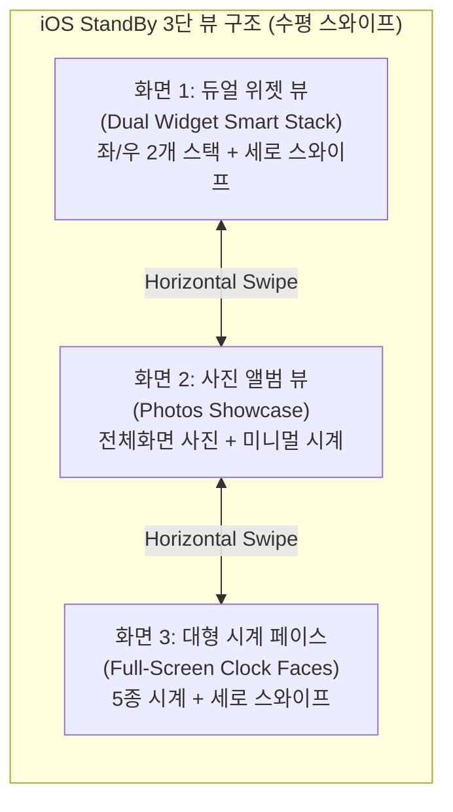
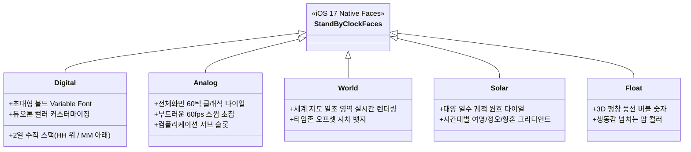
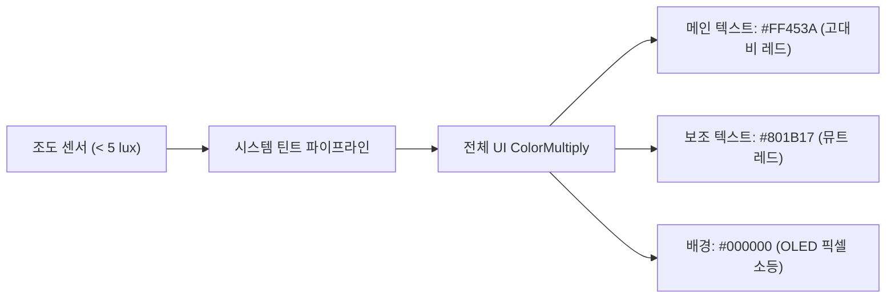

# iOS StandBy Architecture & Design System Specification

> **Target Standard**: Apple iOS 17/18 StandBy Mode, WidgetKit Framework, Human Interface Guidelines (HIG)  
> **Android Target**: Nightstand (`com.lsk0522.nightstand`), Galaxy S25 Ultra (One UI 7), Jetpack Compose  
> **Specification Version**: 1.2.0  

---

## 1. iOS StandBy의 3단 화면 아키텍처 (Screen Hierarchy)

iOS StandBy는 단순한 시계 앱이 아니라, **기기가 가로로 충전 거치되었을 때 시스템 레벨에서 구동되는 전용 대시보드**입니다. 사용자는 **좌우 수평 스와이프(Horizontal Drag)**로 3가지 메인 뷰를 전환합니다:



### 1.1 화면 1: 듀얼 위젯 뷰 (Dual Widget Smart Stack)
- **화면 분할**: 화면 중앙을 기준으로 **좌측 패널**과 **우측 패널**의 2개 스마트 스택으로 분할.
- **위젯 규격**: 오직 **`systemSmall` (1:1 정사각형)** 패밀리 위젯 2개를 나란히 배치.
- **인터랙션**:
  - 각 스택 위에서 **세로 스와이프(Vertical Flick)**를 하면 스택에 등록된 위젯들이 3D 큐브/카드 롤링 형태로 전환.
  - 위젯 롱프레스 시: 지글(Jiggle) 편집 모드 진입 (위젯 추가 `+`, 삭제 `-`, 스마트 회전 On/Off 토글).
  - iOS 17 인터랙티브 위젯: 위젯 내부의 버튼이나 체크박스를 탭하면 앱을 열지 않고 백그라운드 App Intent로 즉시 토글.

### 1.2 화면 2: 사진 뷰 (Photos Showcase)
- 전체 화면을 채우는 엄선된 사진 슬라이드쇼 (인물, 자연, 도시, 반려동물).
- 우측 상단 또는 좌측 상단에 미니멀한 시간 및 촬영 위치 오버레이.
- 은은한 줌인/줌아웃(Ken Burns Effect) 모션.

### 1.3 화면 3: 전체화면 시계 5종 (Full-Screen Clock Faces)
시계 화면에서 **세로 스와이프(Vertical Swipe)**를 하면 5가지 독자적인 시계 페이스가 전환됩니다.



---

## 2. iOS 네이티브 5대 시계 페이스 세부 사양

### 2.1 Digital (디지털 스택)
- **레이아웃**: 상단에 시(HH), 하단에 분(MM)을 2단 수직으로 적층 배치.
- **타이포그래피**: `SF Pro Display`, `fontSize: 140sp`, `fontWeight: 700`, `letterSpacing: -0.04em`.
- **커스터마이징**: 롱프레스 시 컬러 휠(Color Picker) 노출. 단색 화이트, 파스텔, 네온, 듀오톤(상단/하단 서로 다른 색) 변경 가능.

### 2.2 Analog (아날로그 크로노)
- **레이아웃**: 중앙 대형 원형 다이얼(지름 약 280~320dp).
- **눈금**: 12개 메인 인덱스(볼드 바) + 48개 서브 인덱스(0.5dp 헤어라인).
- **핸즈(바늘)**:
  - 시침: 두껍고 끝이 라운드 처리된 캡슐 형태.
  - 분침: 시침보다 길고 슬림한 캡슐.
  - 초침: `system-orange` 또는 유저 선택 액센트 컬러의 초미세 라인, 중심 핀(Pivot)에 1px 하이라이트.
  - **초침 모션**: 1초마다 툭툭 끊기는 쿼츠 틱이 아니라, `requestAnimationFrame` 기준 **초당 60프레임 매끄러운 스윕(Continuous Sweep)**.

### 2.3 World (월드 클락)
- **레이아웃**: 중앙에 세계 지도 실시간 낮/밤 셰이딩(Terminator Line) 렌더링.
- **도시 카드**: 상단과 하단에 설정한 주요 도시(런던, 뉴욕, 도쿄 등)의 현재 시간 및 시차(`+14HRS`) 표기.

### 2.4 Solar (솔라 다이얼)
- **레이아웃**: 하늘의 지평선 원호를 따라 태양 심볼이 회전하는 천문학적 인터페이스.
- **배경 전환**:
  - 일출 전(Night): 딥 네이비 / 퍼플
  - 여명(Dawn): 소프트 핑크 / 오렌지 그라디언트
  - 정오(Noon): 화사한 스카이 블루
  - 일몰(Dusk): 앰버 / 딥 레드

### 2.5 Float (플로트 버블)
- **레이아웃**: 통통하게 부풀어 오른 3D 풍선 형태의 독특한 숫자 폰트.
- **감성**: 캐주얼하고 경쾌한 침실 감성, 높은 채도의 비비드 컬러 팔레트 지원.

---

## 3. iOS 네이티브 디자인 엔지니어링 기술 (SwiftUI & UIKit)

### 3.1 스퀴클과 G2 곡률 연속성 (`style: .continuous`)
Apple은 일반적인 원호 둥글기(`border-radius`)를 사용하지 않습니다. 원호와 직선이 만나는 지점에서 곡률이 $0$에서 $1/r$로 급격히 튀는 시각적 단절을 막기 위해 **G2 곡률 연속성(Superellipse)**을 사용합니다.

```swift
// SwiftUI 네이티브 스퀴클 선언
RoundedRectangle(cornerRadius: 22, style: .continuous)
    .fill(Color(uiColor: .secondarySystemBackground))
```

- **안드로이드(Compose) 대응**:
  일반 `RoundedCornerShape` 대신 3차 베지에 곡선(Cubic Bézier)으로 60% 코너 스무딩(Corner Smoothing)이 적용된 **`SquircleShape`**를 생성하여 클립합니다.

### 3.2 동심 곡률 원칙 (Concentric Radii in iOS)
SwiftUI에서는 하위 뷰가 상위 컨테이너의 곡률을 자동으로 감지하여 완벽한 동심원을 이루도록 **`ContainerRelativeShape()`**를 제공합니다.

$$\mathbf{R_{child} = \max(0, R_{parent} - Padding)}$$

- 위젯 카드 외곽 곡률: `22dp`
- 내부 패딩: `8dp`
- 내부 컴포넌트 곡률: `14dp` ($22 - 8$)

### 3.3 시스템 머티리얼 & 바이브런시 (Materials & Vibrancy)
iOS의 글래스모피즘은 단순 투명도가 아닙니다. 배경 이미지를 실시간으로 가우시안 블러 처리하고 채도를 180% 증폭한 뒤, 그 위에 텍스트의 광도(Luminance)를 합성합니다.

- **SwiftUI Material 토큰**:
  - `.ultraThinMaterial`: 가장 얇은 유리 (배경이 가장 선명히 비침)
  - `.thinMaterial`: 위젯 카드 보조 서피스
  - `.regularMaterial`: 표준 시스템 머티리얼
  - `.thickMaterial`: 팝업 시트 및 모달 배경
- **Compose 구현 공식**:
  ```kotlin
  // Jetpack Compose 글래스모피즘 에뮬레이션
  Modifier
      .background(Color(0x1C1C1E).copy(alpha = 0.70f))
      .blur(radius = 25.dp)
      .border(
          width = 1.dp,
          brush = Brush.verticalGradient(
              colors = listOf(Color.White.copy(alpha = 0.15f), Color.Transparent)
          ),
          shape = SquircleShape(22.dp)
      )
  ```

### 3.4 지터 없는 타이포그래피 (`.monospacedDigit()`)
iOS에서 시계나 카운터를 렌더링할 때 필수적으로 사용하는 수정자입니다:

```swift
Text(timeString)
    .font(.system(size: 140, weight: .bold, design: .default))
    .monospacedDigit() // OpenType 'tnum' 1 강제 활성화
```

- 숫자의 글자폭이 고정되므로 초나 분이 넘어갈 때 전체 텍스트 박스가 흔들리는 지터(Jitter)가 100% 방지됩니다.

---

## 4. 야간 암순응 모드 (Night Vision Red Mode)

### 4.1 생리학적 배경 및 하드웨어 연동
- **조도 센서 트리거**: 주변 조도가 5~10 lux 이하로 떨어지면 활성화.
- **원리**: 붉은색 파장($\sim 650\text{ nm}$)은 인간 망막의 감수체 세포(ipRGCs)를 자극하지 않아 수면 유도 호르몬인 **멜라토닌 분비를 방해하지 않으며**, 어둠에 적응된 시력(암순응, Scotopic Vision)을 깨뜨리지 않습니다.

### 4.2 렌더링 파이프라인


- 모든 UI 요소의 RGB 중 Blue와 Green 채널을 $0$으로 강제 클램핑하고 오직 Red 채널만 투과시킵니다.

---

## 5. Live Activities & 미디어 플레이어 오버레이

iOS StandBy 화면 상단 중앙에는 타이머나 음악 재생 시 **동적 알약(Pill) 형태의 컴팩트 뱃지**가 뜨며, 탭 시 전체 화면 미디어 플레이어로 확장됩니다:
- **컴팩트 모드**: 지름 36dp 앨범 아트 + 실시간 사운드 웨이브폼 애니메이션.
- **확장 모드**: 좌측 대형 앨범 아트(곡률 16dp) + 우측 트랙명/아티스트/재생 컨트롤 바(에어플레이, 이전/재생/다음).

---

## 6. iOS ➡️ Android (Jetpack Compose) 1:1 완벽 매핑 가이드

iOS의 감성을 안드로이드(Galaxy S25 Ultra)에서 100% 동일하게 구현하기 위한 개발자용 1:1 매핑 표입니다:

| iOS (SwiftUI / HIG) | Android (Jetpack Compose) | 구현 기술 / 코드 |
| :--- | :--- | :--- |
| **`style: .continuous`** | `SquircleShape(cornerRadius)` | 3차 베지에 커브 기반 커스텀 Shape |
| **`ContainerRelativeShape()`** | `SubcomposeLayout` / 동심 공식 | $R_{in} = R_{out} - Padding$ 수식 적용 |
| **`.monospacedDigit()`** | `fontFeatureSettings = "tnum"` | Compose `TextStyle` 내 OpenType 플래그 |
| **`.ultraThinMaterial`** | `RenderEffect.createBlurEffect` | Android 12+ (API 31+) 하드웨어 가속 블러 |
| **`Color(uiColor: .systemBackground)`** | `MaterialTheme.colorScheme.background` | OLED 트루 블랙 `#000000` 강제 |
| **`Animation.spring(response:damping:)`** | `spring(dampingRatio, stiffness)` | `StiffnessMediumLow`, `DampingRatioLowBouncy` |
| **`Vertical Pager (Smart Stack)`** | `HorizontalPager` / `VerticalPager` | Foundation Pager + 3D 회전 그래픽 레이어 |
| **`scaleEffect(isPressed ? 0.96 : 1)`** | `animateFloatAsState` on press | 터치 시 `Modifier.scale(0.96f)` 수축 |
