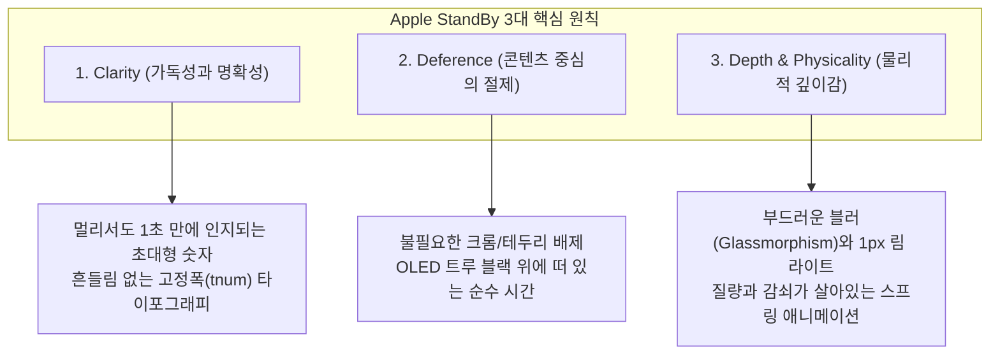
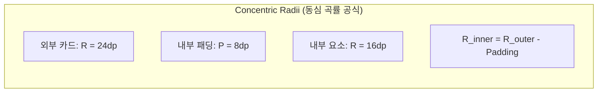
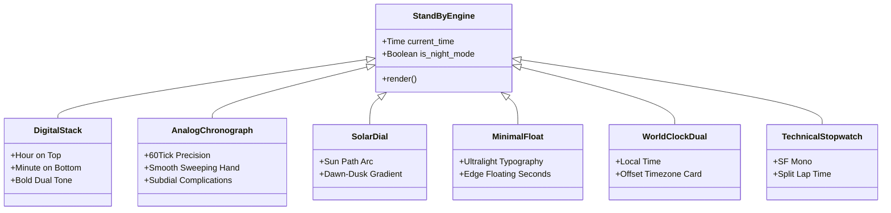

# Design System Specification: Apple StandBy Clock

> **Project**: Nightstand (`com.lsk0522.nightstand`)  
> **Reference Standard**: [getdesign.md/apple](https://getdesign.md/apple/design-md) + Apple Human Interface Guidelines (HIG)  
> **Target Platforms**: Android (Galaxy S25 Ultra One UI 7 / Android 15), Jetpack Compose  

---

## 1. 디자인 철학 (Design Philosophy)

Apple의 하드웨어와 소프트웨어 일체화 경험을 Android StandBy 환경에 완벽하게 재현하기 위해 다음 3대 기본 원칙을 엄격히 준수합니다.



### 1.1 Clarity (명확성)
- 침대 협탁이나 책상 위 거치대(1~2m 거리)에서 곁눈질로 보아도 **1초 안에 시·분과 핵심 정보를 인지**할 수 있어야 합니다.
- 초가 흐르거나 분이 바뀔 때 숫자의 폭 차이로 인해 글자가 떨리는 **지터(Jitter) 현상을 원천 차단**합니다.

### 1.2 Deference (겸손함과 절제)
- 시계와 위젯이 주인공이며, 앱의 관리 인터페이스나 설정 UI는 완전히 배경 뒤로 물러납니다.
- **장식용 그라디언트 배제**: 색상은 기능적 상태(충전 상태, 야간 적색 모드, 활성 타이머)를 나타낼 때만 엄격하게 사용합니다.

### 1.3 Depth & Physicality (물리적 실체감)
- 카드와 레이어는 인위적인 강한 그림자 대신 **투명도, 실시간 블러, 상단 1px 반사광(Rim Light)**을 통해 공간적 층위를 형성합니다.
- 물리 법칙(질량, 감쇠, 관성)에 기반한 스프링 피직스를 적용하여 기계식 시계 부품의 촉각적 질감을 전달합니다.

---

## 2. 타이포그래피 시스템 (Typography Architecture)

Apple 인터페이스의 핵심은 **SF Pro의 엄격한 자간 공식과 고정폭 숫자 제어**입니다.

### 2.1 폰트 패밀리 및 안드로이드 대체(Fallback) 전략
- **기본 폰트**: `SF Pro Display`(34px 이상) / `SF Pro Text`(33px 이하)
- **Android 상용화 대체**:
  - 1순위: **Pretendard** (Apple SF Pro와 동일한 네오 그로테스크 비율, 뛰어난 한글/영문 가독성)
  - 2순위: **Inter** (`font-feature-settings: 'ss03'` 적용 시 SF Pro의 라운드 소문자와 일치)
  - 고정폭/기술 지표: **SF Mono** 또는 **JetBrains Mono**

### 2.2 지터 방지: Tabular Numbers (고정폭 숫자) 필수 규칙
> [!IMPORTANT]
> `1`과 `8`의 글자 너비 차이로 인해 1초마다 시계 숫자가 좌우로 덜덜 떨리는 현상은 Apple 디자인에서 절대 용납되지 않습니다.
> 모든 시계 숫자 텍스트에는 Compose의 `FontFeature` 또는 CSS의 `font-variant-numeric: tabular-nums` (`'tnum' 1`)을 필수로 선언합니다.

```kotlin
// Jetpack Compose 텍스트 스타일 선언 예시
val ClockTextStyle = TextStyle(
    fontFamily = FontFamily(Font(R.font.pretendard_bold)),
    fontSize = 140.sp,
    letterSpacing = (-0.04).em,
    fontFeatureSettings = "tnum" // Tabular numbers 강제
)
```

### 2.3 타이포그래피 스케일 표

| 토큰 | 크기(pt/sp) | 두께(Weight) | 자간(Tracking) | 용도 |
| :--- | :--- | :--- | :--- | :--- |
| `{typography.hero-clock-display}` | `140sp` | 700 (Bold) | `-0.04em` | 2열 수직 스택 시계 메인 시/분 |
| `{typography.hero-clock-medium}` | `88sp` | 600 (SemiBold) | `-0.03em` | 좌우 2분할 패널 시계 |
| `{typography.widget-clock}` | `52sp` | 600 (SemiBold) | `-0.02em` | 위젯 내부 듀얼 타임 |
| `{typography.display-title}` | `34sp` | 600 (SemiBold) | `-0.02em` | 메인 설정 헤더 |
| `{typography.headline}` | `21sp` | 600 (SemiBold) | `-0.01em` | 위젯 카드 타이틀 |
| `{typography.body}` | `17sp` | 400 (Regular) | `-0.02em` | 표준 본문 (16sp가 아닌 17sp) |
| `{typography.caption}` | `14sp` | 400 (Regular) | `0` | 보조 설명, 상태값 |
| `{typography.footnote}` | `12sp` | 500 (Medium) | `+0.02em` | 하단 탭 레이블, AM/PM |

---

## 3. 공간 및 기하학 (Spatial System & Geometry)

### 3.1 8pt 그리드 시스템
모든 뷰의 여백, 패딩, 높이는 **8px 배수**를 철저히 지킵니다:
- **마이크로 간격**: `4dp`, `8dp` (아이콘과 텍스트 사이)
- **컴포넌트 내부 여백**: `16dp`, `24dp` (위젯 카드 패딩)
- **그리드 거터(Gutter)**: `16dp`, `24dp` (좌우 위젯 패널 간격)
- **화면 외곽 세이프 에어리어**: `32dp` (가로 거치 시 베젤과의 시각적 안정 거리)

### 3.2 스퀴클(Squircle)과 동심 곡률 공식 (Concentric Radii)

Apple의 모든 모서리는 단순한 `border-radius` 원호가 아니라, 곡률이 점진적으로 변화하는 **슈퍼타원(Superellipse / G2 연속성)**입니다.



- **동심 곡률 공식**:
  $$\mathbf{Radius_{inner} = Radius_{outer} - Padding}$$
- **적용 예시**:
  - 위젯 카드 외곽 코너: `24dp`
  - 카드 내부 여백(Padding): `8dp`
  - 내부 강조 박스/이미지 코너: `16dp` ($24 - 8$)
  - *이 공식을 벗어나면 모서리 여백이 찌그러져 보이는 시각적 불일치가 발생합니다.*

---

## 4. 컬러 및 머티리얼 (Colors & Materials)

### 4.1 OLED 트루 블랙 캔버스
- StandBy 화면의 배경은 항상 **`#000000` (Pure Black)**입니다.
- Galaxy S25 Ultra의 Dynamic AMOLED 디스플레이에서 픽셀을 완전히 꺼서(0 nit) 번인을 방지하고 배터리 소모를 극소화합니다.

### 4.2 계층적 서피스 컬러
- **`surface-tile-1` (`#1C1C1E`)**: 시간 옆에 나란히 배치되는 위젯 카드의 기본 배경.
- **`surface-tile-2` (`#2C2C2E`)**: 선택된 위젯, 팝업 시트.
- **`border-glass-rim` (`rgba(255, 255, 255, 0.12)`)**: 카드 상단 모서리에 1px 미세 라인을 배치하여 글래스 가장자리에 맺히는 자연스러운 하이라이트를 연출.

### 4.3 야간 암순응 모드 (Night Vision Red Mode)
> [!TIP]
> 야간 조도 센서가 5 lux 이하로 떨어지거나 수면 시간대에 도달하면, 디스플레이 전체가 멜라토닌 분비를 방해하지 않는 **모노크롬 레드** 팔레트로 전환됩니다.

- **Main Glow Red**: `#FF453A` (시계 숫자 및 활성 아이콘)
- **Muted Red**: `#801B17` (보조 텍스트, 날짜, 눈금선)
- **Background**: `#000000` (순수 블랙 유지)

---

## 5. 시계 페이스 6종 아키텍처 (Clock Face Archetypes)

Nightstand 앱이 제공하는 6가지 시계 페이스 디자인 명세입니다:



1. **디지털 스택 (Digital Stack)**:
   - 상단 2자리 시(HH), 하단 2자리 분(MM)의 2열 초대형 타이포그래피.
   - 듀오톤 컬러 옵션 (예: 앰버/화이트, 시안/네이비).
2. **아날로그 크로노그래프 (Analog Chronograph)**:
   - 60틱 정밀 인덱스 눈금, 1초당 60fps로 매끄럽게 회전하는 부드러운 스윕(Continuous Sweep) 초침.
   - 4개 코너 컴플리케이션 슬롯 (배터리, 날짜, 다음 알람, 날씨).
3. **솔라 다이얼 (Solar Dial)**:
   - 태양의 일출/일몰 궤적을 둥근 원호로 시각화하며 시간에 따라 배경 톤이 은은하게 변화.
4. **미니멀 플로트 (Minimal Float)**:
   - 극도로 얇은 `Weight 300 / Ultralight` 폰트를 사용한 미니멀리즘 시계.
5. **월드 클락 듀얼 (World Clock)**:
   - 홈 타임과 해외 출장/지정 도시 시간을 나란히 표시하는 카드형 레이아웃.
6. **테크니컬 스톱워치 (Technical Stopwatch)**:
   - SF Mono 고정폭 기반 밀리초(1/100s) 카운팅과 랩 타임 인터페이스.

---

## 6. 모션 및 인터랙션 피직스 (Motion & Physics)

- **감쇠 진동 스프링**:
  - 버튼 터치 및 위젯 스택 전환 시 선형(Linear) 모션을 배제하고 Spring Spec을 적용합니다.
  - `stiffness = Spring.StiffnessMediumLow`, `dampingRatio = Spring.DampingRatioLowBouncy`
- **마이크로 인터랙션 (Press State)**:
  - 모든 카드와 버튼은 터치 시 색상이 번쩍이는 대신 **`transform: scale(0.96)`로 부드럽게 수축**하는 물리적 반응을 제공합니다.
- **번인 방지 픽셀 시프트 (Pixel Shift)**:
  - 10분마다 시계 전체 컨테이너를 상하좌우로 1~2px 미세 이동시켜 동일 소자의 영구 열화를 방지합니다.

---

## 7. Do's & Don'ts 체크리스트

### Do
- [x] 모든 시계 숫자에 고정폭 속성(`tnum`)을 설정하여 텍스트 흔들림을 방지했는가?
- [x] 위젯 카드 코너 곡률에 동심 공식($R_{in} = R_{out} - Padding$)을 적용했는가?
- [x] 본문 텍스트 기본 크기를 16px이 아닌 **17px**로 설정했는가?
- [x] 버튼 터치 피드백에 `scale(0.96)` 수축 모션을 적용했는가?
- [x] 스탠바이 배경으로 순수 블랙(`#000000`)을 유지하여 OLED 효율을 극대화했는가?

### Don't
- [ ] 정체불명의 화려한 배경 그라디언트를 임의로 삽입하지 않는다.
- [ ] 카드나 버튼에 강하고 인위적인 검은 그림자(Drop Shadow)를 남발하지 않는다.
- [ ] 본문 타이포그래피에 500(Medium) 굵기를 임의로 남용하지 않는다 (Apple 사다리: 300 / 400 / 600 / 700).
- [ ] 초 단위가 변경될 때 레이아웃 리플로우(Layout Shift)가 발생하도록 방치하지 않는다.
