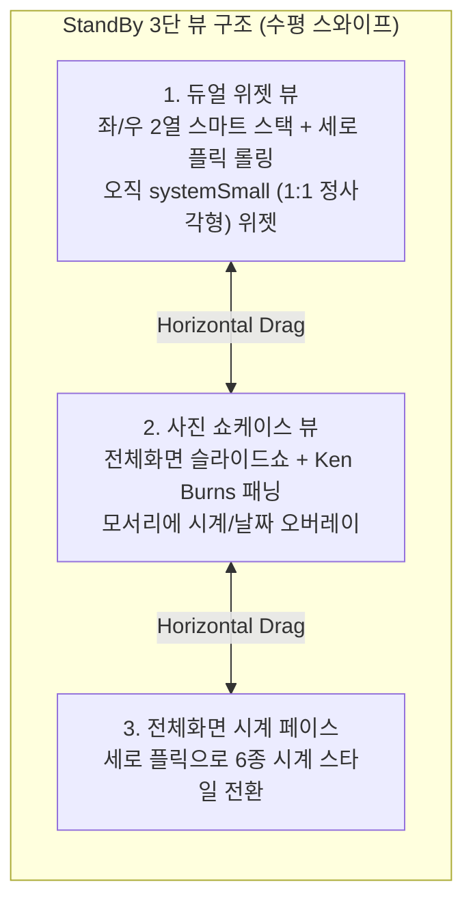
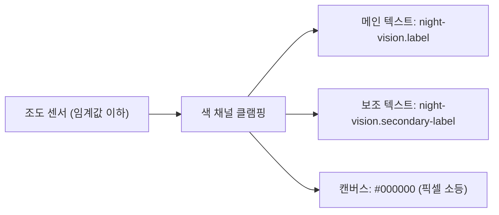

# iOS StandBy — 화면 구조 & 인터랙션 명세

| | |
|---|---|
| **역할** | **무엇을 만드는가** — StandBy 화면의 구조·동작·인터랙션 |
| **기준 버전** | StandBy 기능: iOS 17 도입 / 화면 구조는 현행 유지<br>디자인 언어: **iOS 26 Liquid Glass → iOS 27 개정판** |
| **연계** | Nightstand (`com.lsk0522.nightstand`) — Jetpack Compose |
| **수치** | 색·타이포·곡률·여백은 **`Design.md`** 가 원장. 여기서는 참조만 한다 |

> **이 문서에 쓰지 않는 것**: 토큰 수치(`Design.md`), 구현 규칙과 함정(`CLAUDE.md`), 일정(`plan.md`).

> **재현 수준에 대한 전제**
> 이 문서는 **동작과 감각을 재현**하기 위한 것이지 픽셀 단위 복제가 목표가 아니다.
> 아이콘·폰트·그래픽은 전부 자체 제작하며, Apple 의 에셋은 사용하지 않는다.
> 또한 Smart Rotate(온디바이스 추천)와 Live Activities 는 Android 에 대응물이
> 없으므로 **동등한 대체 동작**을 설계한다.

---

## 0. 개요

StandBy 는 아이폰이 **가로로 충전 거치**되었을 때 자동 기동되는 시스템 레벨 풀스크린 대시보드다.
사용자는 **좌우 수평 스와이프**로 3개의 메인 뷰를 오간다.

---

## 1. 화면 아키텍처 (Screen Hierarchy)



---

## 2. 화면별 세부 UI & 인터랙션

### 2.1 뷰 1 — 듀얼 위젯 스마트 스택

- **레이아웃**
  - 화면 중앙 분할선 기준 **좌측 스택 / 우측 스택** 2열.
  - 지원 규격: iOS 는 **`systemSmall`(1:1 정사각형)만** 허용.
  - 가로 화면에 맞춰 약 **158~170pt** 로 비례 확대 배치.
- **인터랙션**
  - **세로 플릭**: 스택에 등록된 위젯을 상하 롤링 애니메이션으로 전환.
  - **스마트 로테이션**: 시간대·루틴·센서에 맞춰 적절한 위젯을 자동으로 올림.
  - **지글 편집 모드**: 롱프레스(1초+) 시 좌우로 흔들리며 추가 `+` / 삭제 `-` / 순서 변경.
  - **인터랙티브 위젯**: 위젯 내부 버튼·토글을 누르면 앱 전환 없이 백그라운드에서 상태 변경.

> **Android 차이점 (중요)**
> 우리는 `AppWidgetHost` 로 **기기에 설치된 실제 위젯**을 호스팅한다. 안드로이드 위젯은
> 크기 규격이 자유로우므로 `systemSmall` 제약이 없고, 오히려 **정사각형에 가까운 것만
> 걸러내거나 타일에 맞춰 리사이즈**하는 정책이 필요하다. 이건 iOS 보다 자유도가 높은
> 지점이자 이 앱의 차별점이다. 상세는 `plan.md` §2-3.

### 2.2 뷰 2 — 사진 쇼케이스

- 화면 전체를 채우는 앨범 뷰어.
- 카테고리: 인물 / 추천 / 자연 / 도시 — 세로 스와이프로 테마 변경.
- **Ken Burns 효과**: 아주 느린 줌인·패닝으로 정지 사진에 생동감.
- **시계 오버레이**: 모서리에 반투명 캡슐로 시간·위치 표기.

### 2.3 뷰 3 — 전체화면 시계 페이스 (6종)

세로 스와이프로 순환한다. **6종이다** — `Minimal Mono` 가 나중에 추가됐다.

| # | 페이스 | 레이아웃 | 그래픽 스펙 | 커스터마이징 |
|---|---|---|---|---|
| 1 | **Digital** | 상단 시(HH) / 하단 분(MM) 2열 수직 적층 | `hero-clock-display` 토큰, tnum 필수 | 롱프레스 시 컬러 피커 |
| 2 | **Analog** | 60틱 눈금 다이얼 + 캡슐 바늘 | 12 볼드 인덱스 + 48 헤어라인, 스윕 초침 | 초침·인덱스 컬러 |
| 3 | **World** | 세계 지도 + 실시간 낮/밤 일조선 | 대륙별 그림자 영역 + 타임존 오프셋 뱃지 | 도시 선택 |
| 4 | **Solar** | 지평선 원호를 따라 태양이 회전 | 24시간 일주 궤적 + 여명/정오/황혼 그라디언트 | 시간대별 대기광 연동 |
| 5 | **Float** | 통통하게 부푼 입체 숫자 | 버블 볼륨 셰이딩 + 팝 컬러 | 비비드/캔디 팔레트 |
| 6 | **Minimal Mono** | 최소한의 모노크롬 디지털 | ⚠️ **외형 미확인** — 실기기로 확인 후 채울 것 | — |

> ⚠️ `Minimal Mono` 는 이름만 확인됐고 상세 외형은 검증하지 못했다.
> 구현 전 실기기 또는 1차 자료로 확인이 필요하다.
>
> 과거 `plan.md` 에 있던 **"Flip"(플립 카드)은 iOS StandBy 에 존재하지 않는다.**
> 착오로 들어갔던 항목이며 제거됐다.

---

## 3. 렌더링 기술 — iOS 26/27 Liquid Glass 기준

### 3.1 연속 곡률 (Continuous / Squircle)

원형 코너는 직선에서 호로 진입하는 순간 곡률이 0에서 1/r 로 튀어 모서리가 꺾여 보인다.
iOS 는 곡률 변화율이 점진적인 **슈퍼타원**을 쓴다.

```swift
RoundedRectangle(cornerRadius: 22, style: .continuous)
```

- **iOS 26 변경점**: 고정 곡률 대신 **기기 화면 곡률과 동심**이 되도록 `ConcentricRectangle`
  이 도입됐다. 목록 그룹·시트·메뉴의 모서리가 이전보다 눈에 띄게 둥글어졌다.
- 수치는 `Design.md` 의 `rounded.*` 참조 (`list-card` 18px / `widget-tile` 22px).

### 3.2 동심 곡률 공식

중첩된 자식의 곡률은 부모에서 패딩을 뺀 값이다.

```
R_inner = max(0, R_outer − padding)
```

예) 부모 22 − 패딩 8 = 자식 14.

### 3.3 Liquid Glass 머티리얼

> **iOS 26 에서 `.ultraThinMaterial` ~ `.thickMaterial` 4단계 체계가
> Liquid Glass 로 대체됐고, iOS 27 이 이를 다듬었다.**

iOS 27 의 조정 내용:

| 항목 | 내용 |
|---|---|
| **투명도** | iOS 26 은 배경이 복잡할 때 가독성이 떨어졌다 → **기본 투명도를 낮춤** |
| **확산** | 복잡한 콘텐츠를 더 잘 분산시켜 글자가 읽히도록 개선 |
| **가장자리** | 유리 요소에 **어두운 가장자리** 추가 — 배경에서 떠 보이게 함 |
| **하이라이트** | **스페큘러 하이라이트를 더 밝게** |
| **사용자 조절** | 설정에 투명도 슬라이더 (ultra clear ↔ fully tinted) |
| **접근성** | Reduce Transparency / Increase Contrast 에 자동 대응 |
| **툴바** | 콘텐츠가 떠 있는 바 아래로 스크롤되면 상단에 **균일한 툴바**가 나타남 |

구성 요소 4겹 — 하나라도 빠지면 그냥 반투명 판으로 보인다:

1. **배경 블러** — 뒤에 그려진 것을 샘플링해 흐리게
2. **틴트** — iOS 27 기준 불투명도 약 72%
3. **스페큘러 하이라이트** — 상단에서 빛이 떨어지는 느낌
4. **림** — 위는 밝고 아래는 어두운 테두리

수치는 `Design.md` 의 `colors.glass.*` 참조.

### 3.4 지터 방지 타이포그래피

시계 숫자가 `1` ↔ `8` 로 바뀔 때 글자 폭 차이로 레이아웃이 떨리는 현상을 막는다.

```swift
Text(timeString).monospacedDigit()   // OpenType 'tnum' 강제
```

Compose 에서는 `TextStyle(fontFeatureSettings = "tnum")`.
**모든 시계 숫자에 예외 없이 적용한다.**

---

## 4. 야간 암순응 모드 (Night Vision Red)

### 4.1 원리

- **트리거**: 주변 조도가 낮아지면 활성화.
  - ⚠️ **`5 lux` 는 Apple 공식 수치가 아니라 이 프로젝트가 정한 기준값**이다.
    실기기 튜닝 후 조정한다.
- **배경**: 인간 망막의 ipRGC 는 단파장(청색)에 반응해 멜라토닌 분비를 억제한다.
  장파장(적색)은 상대적으로 억제가 덜하다.
- **해결**: 장파장 **모노크롬 레드**와 **OLED 딥 블랙**만 사용해, 야간에 잠에서 깨어
  시계를 보더라도 암순응과 수면 리듬을 덜 깨뜨린다.

### 4.2 렌더링 파이프라인



색값은 `Design.md` 의 `colors.night-vision.*` 참조.

---

## 5. 실시간 정보 오버레이 (Live Activities 대응)

> ⚠️ **미검증 구간.** iOS StandBy 가 라이브 액티비티를 **전체화면으로** 띄우는지,
> 상단 캡슐 뱃지로 띄우는지 확인되지 않았다. 다이내믹 아일랜드의 동작과 혼동하기 쉬운
> 부분이라 **구현 전 실기기 확인이 필요**하다.

음악 재생·타이머 등 진행 중인 활동을 StandBy 화면에 노출한다.

- **컴팩트**: 앨범 아트 + 진행 상태를 작은 영역에 표시.
- **확장**: 탭하면 미디어 플레이어로 전환 — 좌측 대형 아트워크, 우측 트랙 정보와 컨트롤.

**Android 대응**: 라이브 액티비티에 정확히 대응하는 API 는 없다.
`MediaSession` (재생 중 미디어) + 진행 중 알림(`Notification` with progress) 을 읽어
같은 성격의 카드를 구성한다. Phase 6 에서 설계한다.

---

## 6. iOS → Android (Jetpack Compose) 구현 매핑

| iOS (SwiftUI / HIG) | Android (Compose) | 비고 |
|---|---|---|
| `RoundedRectangle(style: .continuous)` | `SquircleShape(radius)` | 베지에 기반 연속 곡률. `RoundedCornerShape` 로는 재현 안 됨 |
| `ConcentricRectangle` (iOS 26+) | `Radius.concentric(outer, padding)` | 수식으로 직접 계산 |
| `.monospacedDigit()` | `fontFeatureSettings = "tnum"` | 시계 숫자 전부 |
| **Liquid Glass** (iOS 26/27) | `Modifier.liquidGlass(shape, hazeState)` | **⚠️ 아래 주의 참조** |
| `.systemGroupedBackground` 등 시맨틱 컬러 | `NightstandTheme.palette.*` | `MaterialTheme.colorScheme` 은 쓰지 않는다 |
| `Animation.spring(response:damping:)` | `spring(dampingRatio, stiffness)` | `LowBouncy` / `MediumLow` |
| Smart Stack 세로 플릭 | `VerticalPager` | `androidx.compose.foundation.pager` |
| `.scaleEffect(0.96)` on press | `Modifier.scale(0.96f)` | 리플 대신 수축 |
| 위젯 (`systemSmall` 고정) | `AppWidgetHost` + `AppWidgetHostView` | 안드로이드는 크기 자유 — 타일에 맞춰 리사이즈 |
| Live Activities | `MediaSession` + 진행 알림 | 1:1 대응물 없음 |
| Smart Rotate (온디바이스 추천) | 규칙 기반 로테이션 | ML 추천은 범위 밖 |

### ⚠️ 블러 매핑 주의

`.ultraThinMaterial` 을 `RenderEffect.createBlurEffect` 로 **1:1 치환할 수 없다.**

- Compose 의 `Modifier.blur` / `graphicsLayer { renderEffect }` 는 **자기 레이어의 내용만**
  흐리게 한다. 뒤에 그려진 배경은 건드리지 못한다.
- 배경 블러는 뒤 콘텐츠를 별도 레이어로 캡처해야 하므로 **`dev.chrisbanes.haze`** 를 쓴다.
  - 블러 대상 콘텐츠에 `Modifier.hazeSource(state)`
  - 유리 표면에 `Modifier.hazeEffect(state) { ... }`
  - API 31 미만은 하드웨어 블러가 없어 `fallbackTint` 로 불투명 처리된다 (minSdk 29 OK)
- **소스와 효과를 분리할 것.** 효과가 자기 소스 안에 들어가면 자기 출력을 다시 먹는다.
  그래서 내비게이션 바와 탭바는 각각 별도 `HazeState` 를 쓴다.

구현체: `core/design/component/LiquidGlass.kt`

---

## 7. 아직 명세되지 않은 것

- StandBy **진입/이탈 동작** — 2초 지연 후 800ms 페이드인, 충전 해제 시 페이드아웃
  (`Design.md` `motion.*` 에 수치만 있고 상태 전이는 미정)
- **세로 방향**일 때의 동작 — iOS 는 가로 전용, 우리는 세로 레이아웃 제공 예정
- 번인 방지 픽셀 시프트의 구체적 이동 패턴
- 위젯 터치와 스택 스와이프 **제스처 우선순위**
- **앱 자체 UI(5개 탭 설정 화면)** — 이 문서 범위 밖. iOS 설정 앱 언어를 따르며
  컴포넌트 규칙은 `CLAUDE.md` 참조
