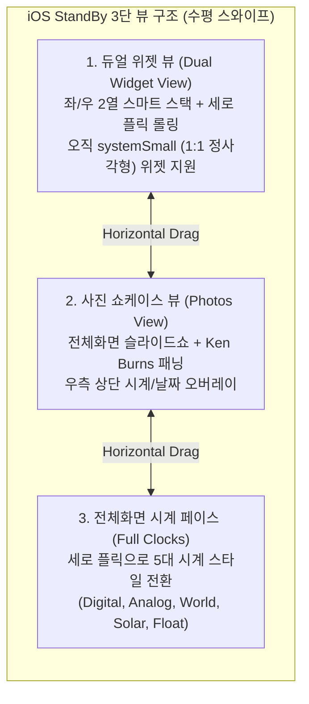
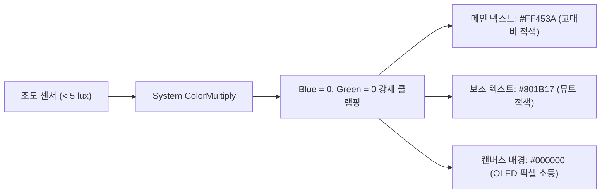

# iOS StandBy & HIG Deep-Dive Design Specification
**문서명**: `iOS_Design.md`  
**대상 버전**: iOS 17 / iOS 18 StandBy Mode, WidgetKit, Apple Human Interface Guidelines (HIG)  
**프로젝트 연계**: Nightstand (`com.lsk0522.nightstand`) — Android Jetpack Compose 1:1 재현 명세  

---

## 0. 개요 (Overview)

이 문서는 Apple의 **iOS 17/18 StandBy 모드 네이티브 아키텍처**, **SwiftUI/WidgetKit 엔지니어링 구현 스펙**, 그리고 **Apple Human Interface Guidelines(HIG)**의 시각적·물리적 규칙을 총망라하여 독립적으로 정리한 **iOS 전용 심층 디자인 명세서**입니다.

---

## 1. iOS StandBy 화면 아키텍처 (Screen Hierarchy)

StandBy는 아이폰이 **가로(Landscape)로 충전 거치**되었을 때 자동으로 기동되는 시스템 레벨의 풀스크린 대시보드입니다. 사용자는 **좌우 수평 스와이프(Horizontal Swipe)**를 통해 3개의 메인 뷰를 전환합니다:



---

## 2. 화면별 세부 UI & 인터랙션 사양

### 2.1 뷰 1: 듀얼 위젯 스마트 스택 (Dual Widget Smart Stack)

- **화면 레이아웃**:
  - 화면 중앙 분할선을 기준으로 **좌측 스마트 스택**과 **우측 스마트 스택** 2개 열로 구성.
  - 지원 위젯 규격: 오직 **`WidgetFamily.systemSmall` (1:1 정사각형)**만 허용.
  - 가로 화면에 맞게 `systemSmall` 위젯을 약 **`158pt ~ 170pt`** 크기로 비례 확대하여 배치.
- **인터랙션 메커니즘**:
  - **세로 스와이프(Vertical Flick)**: 각 스택에 등록된 위젯들을 상하 3D 큐브/롤링 애니메이션으로 넘김.
  - **스마트 로테이션(Smart Rotate)**: 시간대, 사용자 루틴, 센서에 맞춰 시스템이 적절한 위젯을 자동 추천하여 상단으로 올림.
  - **지글(Jiggle) 편집 모드**: 위젯을 롱프레스(1초 이상 길게 누름)하면 좌우로 흔들리며 편집 모드로 진입 (위젯 추가 `+`, 삭제 `-`, 순서 재배치).
  - **인터랙티브 위젯 (iOS 17+)**: 위젯 내부에 배치된 `Button`이나 `Toggle`을 터치할 경우 앱으로 이동하지 않고 백그라운드 App Intent로 즉시 상태 변경.

### 2.2 뷰 2: 사진 쇼케이스 (Photos Showcase)

- **레이아웃**: 화면 전체를 채우는 앨범 사진 뷰어.
- **카테고리 선택**: 인물 사진(People), 추천(Featured), 자연(Nature), 도시(Cities) 등 세로 스와이프로 앨범 테마 변경.
- **Ken Burns 효과**: 사진이 정지해 있지 않고 아주 느린 속도로 미세하게 줌인(Slow Zoom)되거나 패닝(Pan)되어 살아있는 액자 느낌 연출.
- **시계 오버레이**: 우측 상단 또는 좌측 상단에 반투명한 블러 알약(Pill) 형태로 시간과 위치 표기.

### 2.3 뷰 3: 전체화면 시계 5종 (5 Iconic Clock Faces)

시계 화면에서 **세로 스와이프(Vertical Swipe)**를 하면 5가지 독자적인 시계 페이스가 순환합니다:

| 시계 페이스 | 레이아웃 특징 | 타이포그래피 / 그래픽 스펙 | 커스터마이징 |
| :--- | :--- | :--- | :--- |
| **1. Digital** | 상단 시(HH) / 하단 분(MM) 2열 수직 적층 | `SF Pro Display Bold`, 140sp, 자간 `-0.04em` | 롱프레스 시 듀오톤/파스텔/네온 컬러 피커 |
| **2. Analog** | 60틱 정밀 눈금 다이얼 + 캡슐 바늘 | 12개 볼드 인덱스 + 48개 헤어라인 눈금, 60fps 스윕 초침 | 초침 및 인덱스 포인트 컬러 변경 |
| **3. World** | 세계 지도 실시간 낮/밤 일조선(Terminator) | 대륙별 실시간 그림자 영역 렌더링 + 타임존 오프셋 뱃지 | 도시 3곳 선택 (런던, 뉴욕, 도쿄 등) |
| **4. Solar** | 하늘의 지평선 원호를 따라 태양이 회전 | 24시간 태양 일주 궤적 원호 + 여명/정오/황혼 그라디언트 | 시간대별 배경 대기광 자동 연동 |
| **5. Float** | 3D 풍선처럼 통통하게 부풀어 오른 입체 숫자 | 버블(Bubble) 볼륨 셰이딩 + 생동감 넘치는 팝 컬러 | 비비드/캔디 팝 컬러 팔레트 지원 |

---

## 3. iOS 네이티브 엔지니어링 기술 (SwiftUI & UIKit)

Apple이 iOS 플랫폼에서 실제로 사용하는 4대 핵심 UI 렌더링 기술입니다:

### 3.1 스퀴클과 G2 곡률 연속성 (`style: .continuous`)
일반적인 원형 코너(`border-radius`)는 직선에서 원호로 진입하는 순간 곡률이 $0$에서 $1/r$로 급격히 튀어 모서리가 꺾여 보입니다. iOS는 **곡률 변화율이 점진적인 슈퍼타원(Superellipse)**을 사용합니다.

```swift
// SwiftUI 네이티브 스퀴클 곡률
RoundedRectangle(cornerRadius: 22, style: .continuous)
    .fill(Color(uiColor: .secondarySystemBackground))
```

- **iOS 위젯 표준 곡률**: `22pt` (홈 화면 및 StandBy)
- **앱 아이콘 곡률**: 가로 너비의 정확히 **22.5%** ($r = 0.225 \times size$)

### 3.2 동심 곡률 자동화 (`ContainerRelativeShape`)
SwiftUI에서 부모 컨테이너 내부에 중첩된 자식 요소의 곡률을 자동으로 맞춰주는 공식입니다:

$$\mathbf{R_{내부} = \max(0, R_{외부} - Padding)}$$

- 부모 카드 곡률: `22dp`
- 내부 패딩: `8dp`
- 자식 뱃지/이미지 곡률: `14dp` ($22 - 8$)

### 3.3 시스템 머티리얼 & 바이브런시 (Materials & Vibrancy)
iOS의 글래스모피즘은 단순 반투명 레이어가 아니라, 3단계 광학 연산 파이프라인으로 구성됩니다:
1. **가우시안 블러**: 배경 요소를 $20\sim 30\text{pt}$ 반경으로 부드럽게 분산.
2. **채도 부스트**: 흐려진 배경의 채도를 `saturate(180%)` 증폭하여 탁해짐 방지.
3. **루미넌스 바이브런시(Vibrancy)**: 상단 텍스트/아이콘을 배경의 광도(Luminance)와 합성하여 배경 밝기에 따라 스스로 최적의 대비를 형성.

```swift
// SwiftUI Material 계층
.background(.ultraThinMaterial) // 가장 얇고 투명한 유리
.background(.thinMaterial)      // 위젯 카드 보조 배경
.background(.regularMaterial)   // 표준 시스템 유리
.background(.thickMaterial)     // 팝업 및 시트 배경
```

### 3.4 지터(떨림) 방지 타이포그래피 (`.monospacedDigit()`)
시계 숫자가 `1`에서 `8`로 바뀔 때 글자 폭 차이로 인해 레이아웃이 좌우로 덜덜 떨리는 지터(Jitter) 현상을 시스템 차원에서 방지합니다:

```swift
Text(timeString)
    .font(.system(size: 140, weight: .bold, design: .default))
    .monospacedDigit() // OpenType 기능 'tnum' 1 강제 활성화
```

---

## 4. 야간 암순응 모드 (Night Vision Red Mode)

### 4.1 인체공학적·생리학적 원리
- **조도 센서 트리거**: 주변 환경 조도가 **5 lux 이하**로 떨어지면 활성화.
- **원리**: 인간 망막의 내재성 광감수성 신경절 세포(ipRGCs)는 파란색 계열 파장에 반응하여 수면 유도 호르몬인 **멜라토닌 분비를 억제**합니다.
- **해결책**: 최장 파장($\sim 650\text{ nm}$)인 **모노크롬 레드(`#FF453A`)** 단색과 **OLED 딥 블랙(`#000000`)**만을 사용하여, 야간에 잠에서 깨어 시계를 보더라도 암순응(Scotopic Vision)과 수면 리듬을 깨뜨리지 않습니다.

### 4.2 렌더링 파이프라인


---

## 5. Live Activities & 미디어 플레이어 오버레이

iOS StandBy 화면 상단에는 음악 재생, 타이머, 스포츠 경기 중계 등 실시간 정보가 **동적 캡슐 뱃지**로 표시됩니다:
- **컴팩트 모드**: 중앙 상단에 지름 36dp 원형 앨범 아트 + 실시간 사운드 웨이브폼 애니메이션 노출.
- **익스팬디드 모드**: 뱃지를 탭하면 화면 전체가 **미디어 플레이어**로 전환되며, 좌측에 대형 앨범 아트워크, 우측에 트랙 정보와 재생/일시정지/탐색 컨트롤 바가 유려하게 펼쳐짐.

---

## 6. iOS ➡️ Android (Jetpack Compose) 1:1 완벽 구현 매핑

우리가 구현할 Android StandBy 앱(`Nightstand`)에서 iOS 네이티브 느낌을 100% 동일하게 재현하기 위한 기술 매핑 표입니다:

| iOS (SwiftUI / HIG) | Android (Jetpack Compose) | 구현 기술 / 코드 |
| :--- | :--- | :--- |
| **`RoundedRectangle(cornerRadius: 22, style: .continuous)`** | **`SquircleShape(22.dp)`** | 3차 베지에 곡선 기반 60% 코너 스무딩 Shape |
| **`ContainerRelativeShape()`** | **동심 공식 수식 연산** | $R_{in} = R_{out} - Padding$ 수식 적용 |
| **`.monospacedDigit()`** | **`fontFeatureSettings = "tnum"`** | Compose `TextStyle` 내 OpenType 플래그 지정 |
| **`.ultraThinMaterial`** | **`RenderEffect.createBlurEffect`** | Android 12+ 하드웨어 가속 블러 + 1px 림 라이트 |
| **`Color(uiColor: .systemBackground)`** | **`MaterialTheme.colorScheme.background`** | OLED 트루 블랙 `#000000` 지정 |
| **`Animation.spring(response:damping:)`** | **`spring(dampingRatio, stiffness)`** | `StiffnessMediumLow`, `DampingRatioLowBouncy` |
| **`Vertical Pager (Smart Stack)`** | **`VerticalPager`** | `androidx.compose.foundation.pager.VerticalPager` |
| **터치 반응 `scaleEffect(0.96)`** | **`Modifier.scale(0.96f)`** | 누를 때 부드러운 수축 물리 피드백 |
